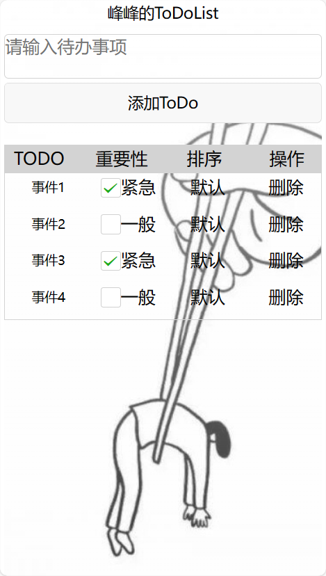
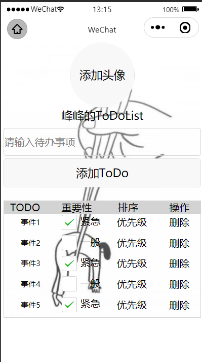
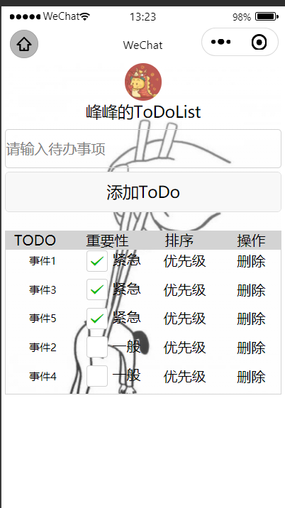

# Taro开发todolist

## 一、基本页面（h5&weapp）
### h5

### weapp

## 二、功能

- 对输入框内的ToDo进行校验，重复或为空（包括只有空格）无法添加
- 添加事件后，可以手动选择优先级
- 点击「排序」可以切换排序方式，支持默认排序（创建时间）以及优先级排序
- 点击删除可以删除事件
- 支持h5和微信小程序端，weapp内添加上传头像功能

